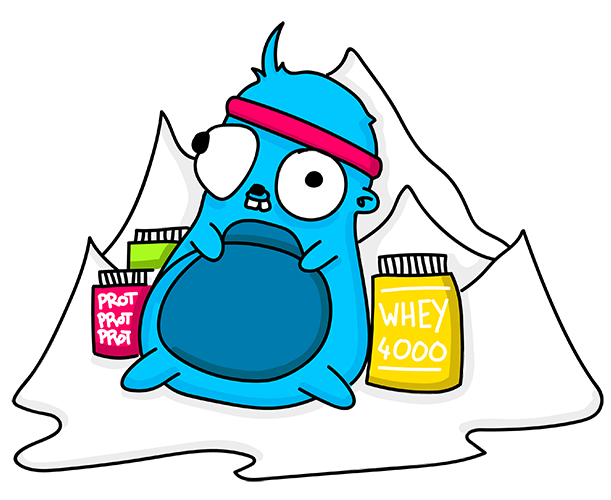

<p align="center">
  
</p>

# Protein  [](http://godoc.org/github.com/znly/protein)

*Protein* is an encoding/decoding library for [*Protobuf*](https://developers.google.com/protocol-buffers/) that comes with schema-versioning and runtime-decoding capabilities.

It has multiple use-cases, including but not limited to:
- setting up schema registries
- decoding Protobuf payloads without the need to know their schema at compile-time (all the while keeping strong-typing around!)
- identifying & preventing applicative bugs and data corruption issues
- creating custom-made container formats for on-disk storage
- ...and more!

*Protein* is divided into 3 sub-components that all play a critical role in its operation:
- The [`protoscan` API](./protoscan.go) walks through the symbols of the running executable to find every instanciated protobuf schemas, collect them, build the dependency trees that link them together and finally compute the deterministic versioning hashes that ultimately define them.
- The [`protostruct` API](./protostruct.go) is capable of creating structure definitions at runtime using the dependency trees of protobuf schemas that were previously computed by the `protoscan` API.
- The [`Transcoder` class](./transcoder.go) implements the high-level, user-facing encoding/decoding API that ties all of this together and offers the tools to cover the various use-cases cited above.

An upcoming blog post detailing the inner workings of these components is in the works and shall be available soon.

Have a look at the [Quickstart](#quickstart) section to get started.

---

:warning: **IMPORTANT NOTE REGARDING VENDORING (I.E. IT WON'T COMPILE)** :warning:

*Protein* makes use of Go's [`linkname` feature](https://golang.org/cmd/compile/) in order to be able to sniff protobuf schemas off of memory.

The `go:linkname` directive instructs the compiler to declare a local symbol as an alias for an external one, whether it is public or private.
This allows *Protein* to bind to some of the private methods of the official protobuf package for various reasons (see [here](https://github.com/znly/protein/blob/8e8fe658a5e929b325e8a6460da34393031bdfd8/transcoder.go#L334-L348) and [there](https://github.com/znly/protein/blob/36036430febc7b455e14830b6bfd9ac93f4d4633/protostruct.go#L293-L307) for more information).

Unfortunately, vendoring modifies symbol names due to the way mangling works; e.g. a symbol called `github.com/gogo/protobuf/protoc-gen-gogo/generator.(*Generator).goTag` actually becomes `github.com/myname/myproject/vendor/github.com/gogo/protobuf/protoc-gen-gogo/generator.(*Generator).goTag` once the `gogo/protobuf` package gets vendored inside the `myname/myproject` package.  

*These modifications to the symbol names result in the **dreaded** `relocation target <symbol-name> not defined` error at compile time.*

The good news is that *Protein* provides all that's necessary to fix those errors automatically, you just have to follow these commands:
```sh
$ go get -u github.com/znly/linkname-gen
$ go generate ./vendor/github.com/znly/protein/...
```
And voila, it compiles again!

---

**Table of Contents:**  
<!-- START doctoc generated TOC please keep comment here to allow auto update -->
<!-- DON'T EDIT THIS SECTION, INSTEAD RE-RUN doctoc TO UPDATE -->


- [Usage](#usage)
  - [Quickstart](#quickstart)
  - [Error handling](#error-handling)
  - [Logging](#logging)
  - [Monitoring](#monitoring)
- [Performance](#performance)
- [Contributing](#contributing)
  - [Running tests](#running-tests)
  - [Running benchmarks](#running-benchmarks)
- [Authors](#authors)
- [See also](#see-also)
- [License](#license-)

<!-- END doctoc generated TOC please keep comment here to allow auto update -->

## Usage

### Quickstart

This quickstart demonstrates the use of the *Protein* package in order to:
- initialize a `Transcoder`
- sniff the local protobuf schemas from memory
- synchronize the local schema-database with a remote datastore (`redis` in this example)
- use a `Transcoder` to encode & decode protobuf payloads using an already known schema
- use a `Transcoder` to decode protobuf payloads without any prior knowledge of their schema

The complete code for the following quickstart can be found [here](./transcoder_test.go).

**Prerequisites**

First, we need to set up a local `redis` server that will be used as a schema registry later on:
```sh
$ docker run -p 6379:6379 --name schema-reg --rm redis:3.2 redis-server
```
Then we open up a pool of connections to this server using [*garyburd/redigo*](https://github.com/garyburd/redigo):
```Go
p := &redis.Pool{
  Dial: func() (redis.Conn, error) {
    return redis.DialURL("redis://localhost:6379/0")
  },
}
defer p.Close()
```

**Initializing a `Transcoder`**

```Go
// initialize a `Transcoder` that is transparently kept in-sync with
// a `redis` datatore.
trc, err := NewTranscoder(
  // this context defines the timeout & deadline policies when pushing
  // schemas to the local `redis`; i.e. it is forwarded to the
  // `TranscoderSetter` function that is passed below
  context.Background(),
  // the schemas found in memory will be versioned using a MD5 hash
  // algorithm, prefixed by the 'PROT-' string
  protoscan.MD5, "PROT-",
  // configure the `Transcoder` to push every protobuf schema it can find
  // in memory into the specified `redis` connection pool
  TranscoderOptSetter(NewTranscoderSetterRedis(p)),
  // configure the `Transcoder` to query the given `redis` connection pool
  // when it cannot find a specific protobuf schema in its local cache
  TranscoderOptGetter(NewTranscoderGetterRedis(p)),
)
```

Now that the `Transcoder` has been initialized, the local `redis` datastore should contain all the protobuf schemas that were sniffed from memory, as defined by their respective versioning hashes:
```sh
$ docker run -it --link schema-reg:redis --rm redis:3.2 redis-cli -h redis -p 6379 -c KEYS '*'

  1) "PROT-31c64ad1c6476720f3afee6881e6f257"
  2) "PROT-56b347c6c212d3176392ab9bf5bb21ee"
  3) "PROT-c2dbc910081a372f31594db2dc2adf72"
  4) "PROT-09595a7e58d28b081d967b69cb00e722"
  5) "PROT-05dc5bd440d980600ecc3f1c4a8e315d"
  6) "PROT-8cbb4e79fdeadd5f0ff0971bbf7de31e"
     ... etc ...
```

**Encoding stuff**

We'll create a simple object for testing encoding & decoding functions, using the `TestSchemaXXX` protobuf schema defined [here](./protobuf/test_schema_xxx.proto):
```Go
obj := &test.TestSchemaXXX{
  Ids: map[int32]string{
    42:  "the-answer",
    666: "the-devil",
  },
}
```

Encoding is nothing spectacular, the `Transcoder` will hide the "hard" work of bundling the versioning metadata within the payload:
```Go
// wrap the object and its versioning metadata within a `ProtobufPayload` object,
// then serialize the bundle as a protobuf binary blob
payload, err := trc.Encode(obj)
if err != nil {
  log.Fatal(err)
}
```

**Decoding stuff**

We'll try to decode the previous `payload` into the following object:
```Go
var myObj test.TestSchemaXXX
```

Trying to decode the payload using the standard `proto.Unmarshal` method will fail in quite cryptic ways since vanilla protobuf is unaware of how *Protein* bundles the versioning metadata within the payload... Don't do this!
```Go
_ = proto.Unmarshal(payload, &myObj) // NOPE NOPE NOPE!
```

Using the `Transcoder`, on the other hand, will allow to properly unbundle the data from the metadata before unmarshalling the payload:
```Go
err = trc.DecodeAs(payload, &myObj)
if err != nil {
  log.Fatal(err)
}
fmt.Println(myObj.Ids[42]) // prints the answer!
```

**Decoding stuff dynamically (!)**

Runtime-decoding does not require any more effort on the part of the end-user than simple decoding does, although *a lot* of stuff is actually happening behind-the-scenes:
1. the versioning metadata is extracted from the payload
2. the corresponding schema as well as its dependencies are lazily fetched from the `redis` datastore if they're not already available in the local cache (using the `TranscoderGetter` that was passed to the constructor)
3. a structure-type definition is created from these schemas using Go's reflection APIs, with the right protobuf tags & hints for the protobuf deserializer to do its thing
4. an instance of this structure is created, then the payload is unmarshalled into it

```Go
myRuntimeObj, err := trc.Decode(context.Background(), payload)
if err != nil {
  log.Fatal(err)
}
myRuntimeIDs := myRuntimeObj.Elem().FieldByName("IDs")
fmt.Println(myRuntimeIDs.MapIndex(reflect.ValueOf(int32(666)))) // prints the devil!
```

### Error handling

*Protein* uses the [`pkg/errors`](https://github.com/pkg/errors) package to handle error propagation throughout the call stack; please take a look at the related documentation for more information on how to properly handle these errors.

### Logging

*Protein* rarely logs, but when it does, it uses the global logger from Uber's [*Zap*](https://github.com/uber-go/zap) package.  
You can thus control the behavior of *Protein*'s logger however you like by calling [`zap.ReplaceGlobals`](https://godoc.org/go.uber.org/zap#ReplaceGlobals) at your convenience.

For more information, see *Zap*'s [documentation](https://godoc.org/go.uber.org/zap).

### Monitoring

*Protein* does not offer any kind of monitoring hooks, yet.

## Performance

Configuration:
```
MacBook Pro (Retina, 15-inch, Mid 2015)
Intel(R) Core(TM) i7-4870HQ CPU @ 2.50GHz
```

Encoding:
```
## gogo/protobuf ##

BenchmarkTranscoder_Encode/gogo/protobuf        300000    4287 ns/op
BenchmarkTranscoder_Encode/gogo/protobuf-2     1000000    2195 ns/op
BenchmarkTranscoder_Encode/gogo/protobuf-4     1000000    1268 ns/op
BenchmarkTranscoder_Encode/gogo/protobuf-8     1000000    1258 ns/op
BenchmarkTranscoder_Encode/gogo/protobuf-24    1000000    1536 ns/op

## znly/protein ##

BenchmarkTranscoder_Encode/znly/protein         300000    5556 ns/op
BenchmarkTranscoder_Encode/znly/protein-2       500000    2680 ns/op
BenchmarkTranscoder_Encode/znly/protein-4      1000000    1638 ns/op
BenchmarkTranscoder_Encode/znly/protein-8      1000000    1798 ns/op
BenchmarkTranscoder_Encode/znly/protein-24     1000000    2288 ns/op
```

Decoding:
```
## gogo/protobuf ##

BenchmarkTranscoder_DecodeAs/gogo/protobuf      300000    5970 ns/op
BenchmarkTranscoder_DecodeAs/gogo/protobuf-2    500000    3226 ns/op
BenchmarkTranscoder_DecodeAs/gogo/protobuf-4   1000000    2125 ns/op
BenchmarkTranscoder_DecodeAs/gogo/protobuf-8   1000000    2015 ns/op
BenchmarkTranscoder_DecodeAs/gogo/protobuf-24  1000000    2380 ns/op

## znly/protein ##

BenchmarkTranscoder_Decode/znly/protein        200000     6777 ns/op
BenchmarkTranscoder_Decode/znly/protein-2      500000     3986 ns/op
BenchmarkTranscoder_Decode/znly/protein-4      500000     2630 ns/op
BenchmarkTranscoder_Decode/znly/protein-8      500000     2973 ns/op
BenchmarkTranscoder_Decode/znly/protein-24     500000     3037 ns/op
```

See [*transcoder_test.go*](./transcoder_test.go) for the actual benchmarking code.

## Contributing

Contributions of any kind are welcome; whether it is to fix a bug, clarify some documentation/comments or simply correct english mistakes and typos: do feel free to send us a pull request.

*Protein* is pretty-much frozen in terms of features; if you still find it to be lacking something, please file an issue to discuss it first.  
Also, do not hesitate to open an issue if some piece of documentation looks either unclear or incomplete to you, nay is just missing entirely.

*Code contributions must be thoroughly tested and documented.*

### Running tests

```sh
$ docker-compose -f test/docker-compose.yml up
$ ## wait for the datastores to be up & running, then
$ make test
```

### Running benchmarks

```sh
$ make bench
```

## Authors

See [AUTHORS](./AUTHORS) for the list of contributors.

## See also

- [*Docker-Protobuf*](https://github.com/znly/docker-protobuf): an all inclusive `protoc` suite for *Protobuf* and *gRPC*.

## License 

The Apache License version 2.0 (Apache2) - see [LICENSE](./LICENSE) for more details.

Copyright (c) 2017	Zenly	<hello@zen.ly> [@zenlyapp](https://twitter.com/zenlyapp)
